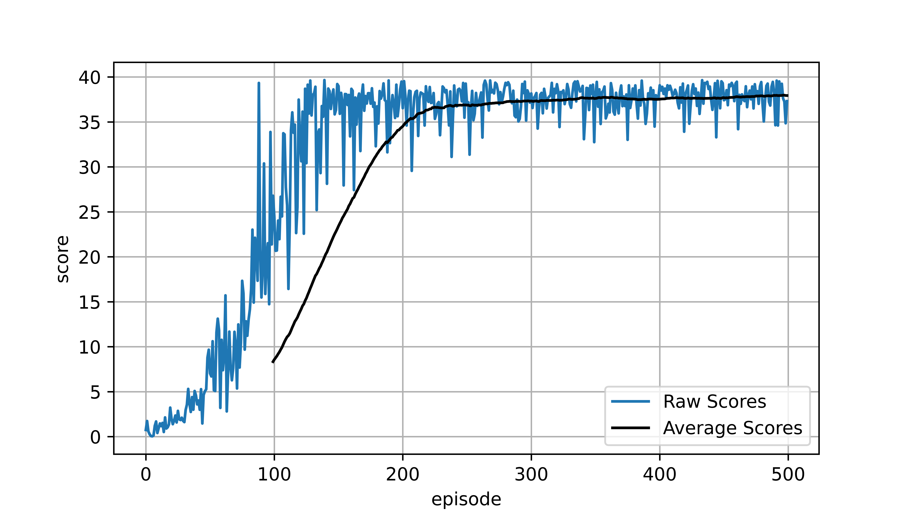

## Deep Deterministic Policy Gradients (DDPG) architecture

This repository is extracted from a project assignment of the Deep Reinforcement Learning course by Udacity.
An environment consisting of a two-link robot arm is solved by mean of a Deep Deterministic Policy Gradients (DDPG) algorithm. 

The environment has a state space of 33 variables and an action space of 4. The environment is considered solved when the averagecore of 100 consecutive runs is above 30.0

The DNNs implemented for Critic and Actor are as follows:

- Actor DNN:
    - Input Layer: (33, 400) - Batch Normalization - Relu
    - First Hidden Layer: (400, 300) - Batch Normalization - Relu
    - Output Layer: (300, 4) - Tanh

- Critic DNN:
    - Input Layer: (33, 400) - Batch Normalization - Relu
    - First Hidden Layer: (400, 300) - Batch Normalization - Relu
    - Action Layer (4,300) - Relu
    
    First and Action Layer are summed to obtain the Output Layer
    - Output Layer: (300, 1) - Linear 

## Hyper Parameter

The hyper parameters of the algorithm and their values are reported below:

- noise paramter theta = 0.15
- noise paramter sigma = 0.2
- buffer size = int(1e6) 
- batch size = 128
- actor hidden dimension = (400,300)
- critic hidden dimension = (400,300)
- critic learning rate= 0.00025
- actor learning rate = 0.000025
- tau = 0.001
- gamma = 0.99      
- weight decay = 0
- update every # iteration = 1

## Results

The raw and averaged score recorded during traning are reported below.
The algorithm is capable of solving the environment in approximately 160 episodes.

## Future improvements

The algorithm can be further improved by performing some in depth hyper parameters tuning

A further improvement could result from the use of N-step returns and prioritized experience replay, as reported in the paper for [D4PG](https://openreview.net/forum?id=SyZipzbCb). This algorithm proved to be effective in complex manipulation task analogous to the one reported in this repository.

## References

- [CONTINUOUS CONTROL WITH DEEP REINFORCEMENT LEARNING](https://arxiv.org/abs/1509.02971) - Timothy P. Lillicrap,Jonathan J. Hunt,Alexander Pritzel,Nicolas Heess,Tom Erez,Yuval Tassa,David Silver & Daan Wierstra - Google Deepmind
- DDPG implementation by [Phil Tabor](https://github.com/philtabor/Youtube-Code-Repository/tree/master/ReinforcementLearning/PolicyGradient/DDPG/pytorch/lunar-lander)

